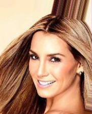
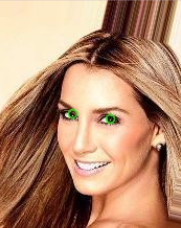
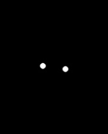
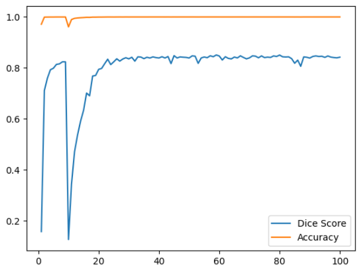
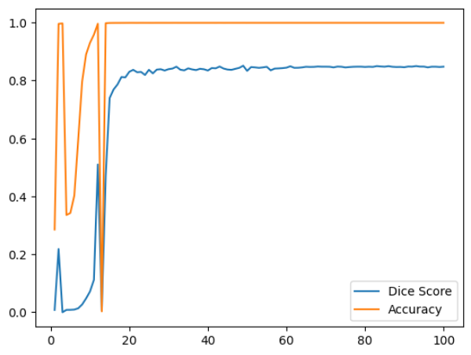
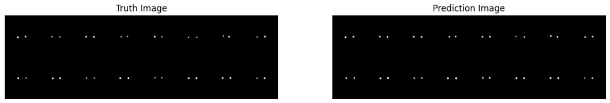

# Eye Segmentation Project

The goal here is to implement a UNET model and train it on 178x218 pixels face images

Here is the UNET model architecture :

First we have to refine our Data and create masks. I chose to use mediapipe inside my **[Eye_dataset_segmentation.py](https://github.com/Shifoue/Portfolio/blob/main/Eye_Segmentation_Project/Eye_dataset_segmentation.py)** script which help me create mesh for each faces that i use to approximate a mask for the eyes.

<table width="100%">
  <tr>
    <td width="33%">Image before creating mesh</td>
    <td width="33%">Image with eyes position approximated based on mesh</td>
    <td width="33%">Mask generated based on eyes position approximation</td>
  </tr>
  <tr>
    <td></td>
    <td></td>
    <td></td>
  </tr>
</table>

Once the masks were created i splitted my data in two parts :
  - Training data and masks
  - Validation data and masks

Finally i emplemented my UNET architecture, refined the Data using basic data augmentation and trained the model.

For the loss function of my model i chose to implement a dice score (IoU) which forces my model to predict as close as possible to the masks instead of going for an all black or white strategy that would give him a good accuracy but would be pretty bad for what we want.

I conducted a quick study of the ADAMW and SGD optimizer and chose to use ADAMW as the final optimizer:

<table width="100%">
  <tr>
    <td width="50%">Impact of ADAMW optimizer with LR=1e-4</td>
    <td width="50%">Impact of SGD optimizer with LR=1e-2</td>
  </tr>
  <tr>
    <td></td>
    <td></td>
  </tr>
</table>

As validation metric i used the Dice Score and it works fine, following is a comparison between real mask and predicted masks :

